# VDL Studio — Visual Dia|gram Language editor

A single-page, offline editor for drawing **Dia|gram** figures — the graphical diagnostic
analysis language used throughout the book
[*Trace, Log, Text, Narrative, Data: An Analysis Pattern Reference for Information Mining, Diagnostics, Anomaly Detection*, Fifth Edition](https://www.dumpanalysis.org/trace-log-analysis-pattern-reference)
by Dmitry Vostokov, Software Diagnostics Institute (OpenTask, 2023, ISBN 978-1-912636-58-7) — time
axes, traces with message rows and attribute columns, message blocks, annotations, arrows, graphs.
The Dia|gram language itself is described at
<https://www.dumpanalysis.org/diagram-diagnostic-analysis-language>.

No installation, no server, no external libraries: open `VDLStudio.html` in Chrome or Edge
(Firefox works too, but saves fall back to downloads).

## Folder layout

```
VDLStudio/
  VDLStudio.html      the editor (any file name works — the js/, css/ and reference/ folders must stay beside it)
  css/studio.css
  js/palette.js       the Office colour palette used by the book figures
  js/catalog.js       all 231 pattern names of the Fifth Edition + their figure files
  js/model.js         element types, defaults, property schemas, geometry
  js/render.js        SVG renderer (shared by the canvas and the exporters)
  js/export.js        SVG / PNG export, file save/open, ZIP writer
  js/templates.js     starter layouts and the "book project" builder
  js/editor.js        the interactive editor
  reference/          the 271 figures extracted from the book (tracing references)
  samples/            example exports (SVG, PNG, .vdl.json); samples/workflow/ holds the
                      step-by-step screenshots of the worked example below
```

## First start — the book project

The editor opens the **book project**: a work plan for redrawing the book's figures, not a
set of finished diagrams. The list at the bottom left has one entry per figure of the Fifth
Edition of [the book](https://www.dumpanalysis.org/trace-log-analysis-pattern-reference) (271 figures across 231 patterns; a pattern with several figures gets numbered entries,
e.g. *Adjoint Space (1)…(3)*) plus one empty entry for each of the 24 patterns that have no
figure — 296 entries in all.

Each entry carries the original figure from the book as a locked, half-transparent
**reference** underlay. Draw the Dia|gram elements over it, untick *Refs* in the toolbar to
check the result, then export — references are never exported. Three entries (*Activity
Region*, *Blackout*, *Activity Packet*) already contain reconstructions made this way; the
next section shows how one of them was made.

In the list, ● and the number on the right show entries that contain drawn elements (the
reference does not count), so the list doubles as a progress index; the filter box searches
by name and pattern. The project is optional: `New → Blank project` starts empty, and
`From pattern…` adds any single pattern, with or without its figure, on demand.

Everything you do is kept in the browser's local storage, but do save the project to a
file (`Save` → `<name>.vdlp.json`) — that is the file to keep and to reopen with `Open…`.

## Worked example — the *Blackout* figure, step by step

Every screenshot below was taken from the editor while the figure was being drawn with the
mouse and the properties panel; the resulting diagram is `samples/workflow/blackout-tutorial.vdl.json`
(`Open…` adds it to the current project). Positions need not be exact: everything snaps to the
4 px grid (one message row) and to the edges of elements already on the page.

**1. Start an entry with the book figure as reference.** `New → Blank project`, then
`From pattern…` in the *Diagrams* panel, type `blackout`, pick the pattern and click
*Add diagram*. (In the ready-made book project this entry already exists — just click it.)

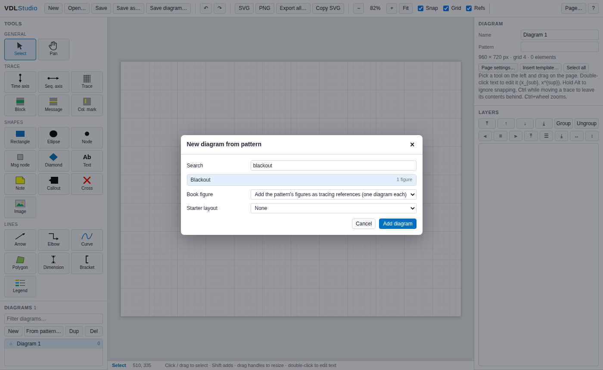

The new diagram shows the book figure at 55 % opacity; it is locked, so clicks go through it.

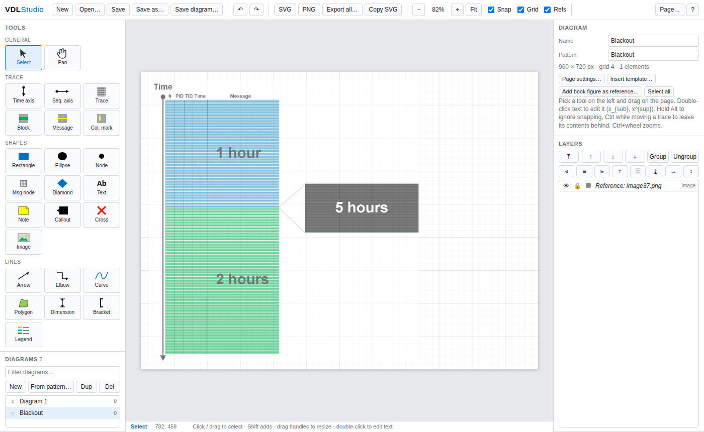

**2. Time axis.** Pick *Time axis* and drag from the reference's dot at the top to its arrow
tip at the bottom. The axis is selected afterwards; in the properties panel set *Font size*
to 11 and *Line width* to 2 to match the figure's heavier axis.

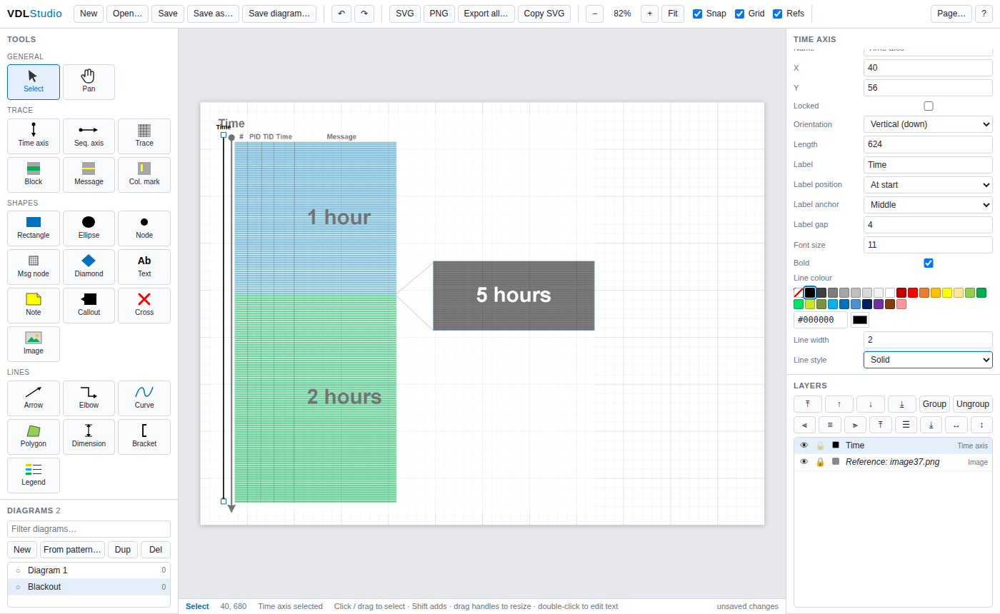

**3. Trace.** Pick *Trace* and drag over the trace rectangle of the figure. In the properties
panel click the *Steel Blue* swatch under *Fill*, widen the attribute columns with
*Columns spec* `#:14,PID:18,TID:18,Time:22,Message`, and set *Header size* to 7. The message
rows (light lines) and column lines are drawn automatically.

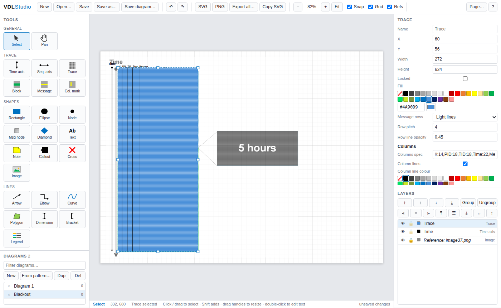

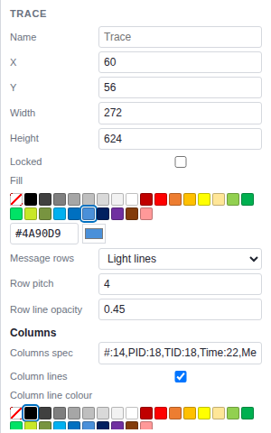

**4. Message blocks.** Pick *Block* and drag over the lower half of the trace; choose *Green*
under *Fill*. Blocks inside a trace inherit its row texture and column lines and move with it.
Double-click the block, type `2 hours`, press Enter; then set *Font size* 26 and *Text colour*
*Gray 75*. Repeat for the upper half with *Steel Blue* and `1 hour`.

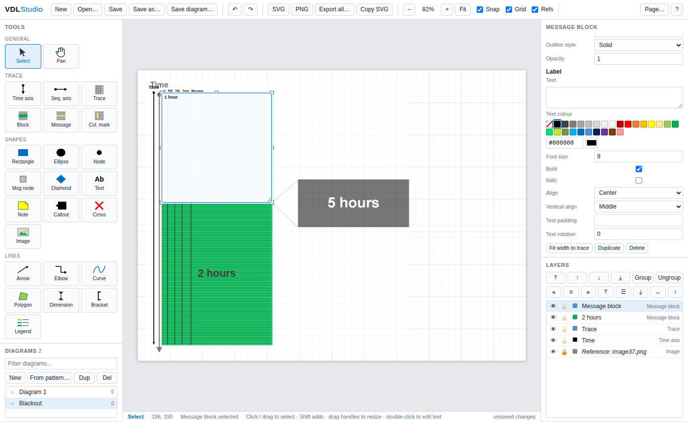

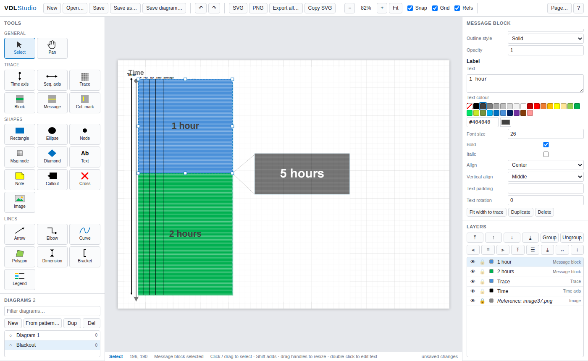

**5. Callout.** Pick *Rectangle*, drag the black box, choose *Black* under *Fill*, double-click
and type `5 hours`, set *Font size* 26 and *Text colour* *White*. For the two wedge lines pick
*Arrow* and drag from the trace edge to the box corners; then select both lines (click, Shift+click)
and set *End cap* to *None*, *Line colour* to *Gray 50* and *Line width* to 1 — a property
change applies to every selected element.

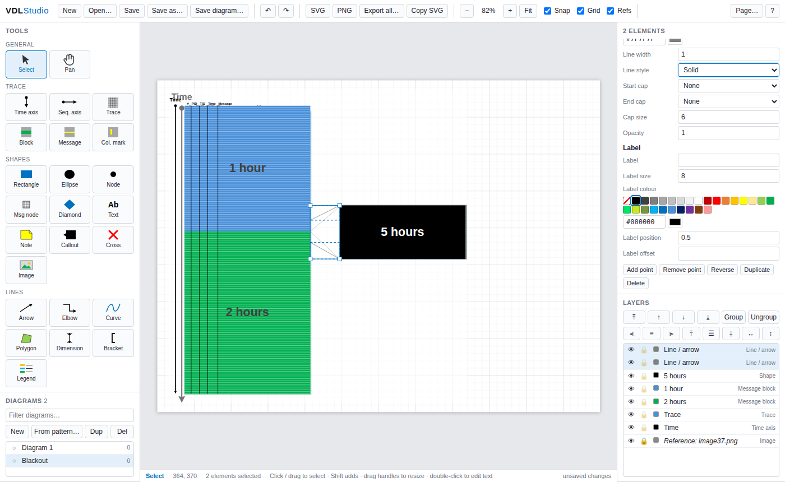

**6. Check against the original.** Untick *Refs* in the toolbar to hide the reference (and tick
it again to compare). Save the project with `Save` (Ctrl+S).

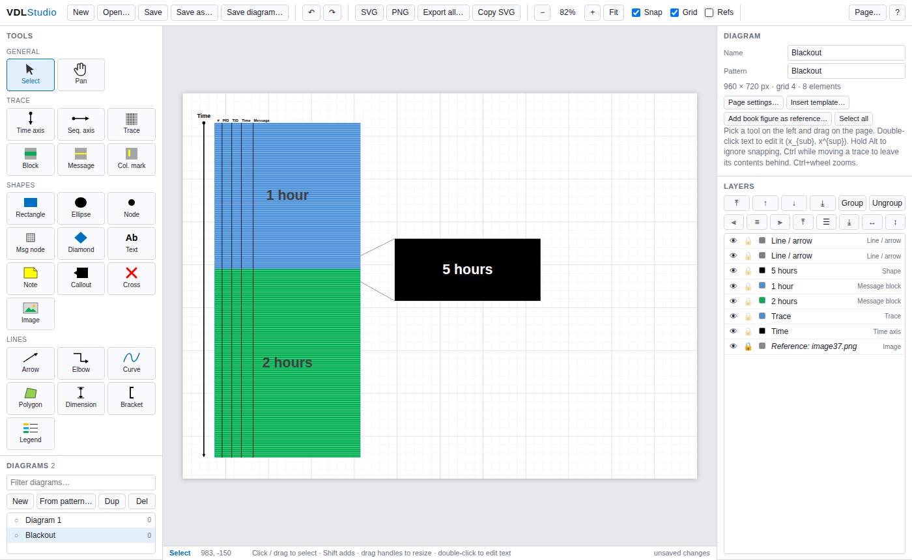

**7. Export.** `PNG` (or `SVG`) opens the export dialog: content bounds with a margin, white
background, 2× scale for print. The reference is never part of the export.

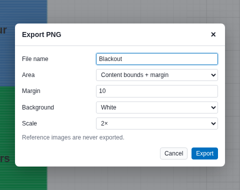

The exported file:

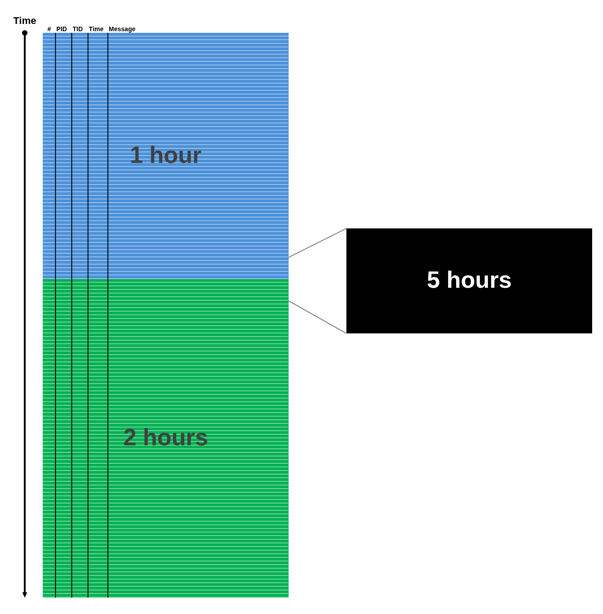

## Drawing

| Tool | Notes |
|---|---|
| **Time axis / Seq. axis** | Drag from the start dot towards the arrow end (any of the four directions). Label, caps and line width are properties. |
| **Trace** | The trace frame: fill, message-row texture (light/dark/text lines), row pitch, columns (`#:10,PID:12,TID:12,Time:16,Message` — last column takes the remainder), column lines, header labels. Elements inside a trace move with it (hold Ctrl to leave them behind). |
| **Block / Message / Col. mark** | Message blocks (activity regions), single message rows (height = row pitch) and vertical column highlights (TID/ATID). A block dropped inside a trace takes its width and inherits its row texture and column lines. |
| **Rectangle, Ellipse, Node, Msg node, Diamond, Note, Callout, Cross, Bracket** | Shapes with fill/gradient/outline/label; `Shape` property switches between rectangle, rounded, note, tag, diamond, triangle, hexagon, parallelogram, callout, cross, bracket. |
| **Text** | Click to place, double-click to edit. `x_{sub}` and `x^{sup}` give sub/superscripts (`J_{m1}`, `T^{2}`); Shift+Enter inserts a line break. |
| **Arrow / Elbow / Curve / Polygon / Dimension** | Drag for a two-point line, or click-click-click and finish with Enter or a double-click (Esc cancels). Double-click a line to add a vertex; drag the yellow vertex handles. Caps: arrow, open arrow, dot, bar, diamond, square. |
| **Legend** | One item per line: `#FFC000 Initialization`. |
| **Image** | Insert a picture (PNG/JPG/SVG). Tick *Reference* to use it only as a tracing aid. |

Snapping: positions snap to the grid (default 4 px = one message row) and to edges, centres
and column boundaries of other elements (magenta guides). Hold **Alt** to bypass, **Shift**
to constrain movement or keep aspect ratio while resizing.

Right panel: properties of the selection (colour swatches are the book palette), then the
layer list (visibility, lock, z-order, group/ungroup, align/distribute).

## Files and export

* `Save` / `Save as…` — the whole project (`.vdlp.json`).
* `Save diagram…` — only the current diagram (`.vdl.json`); `Open…` adds such a file to the project.
* `SVG` / `PNG` — export the current diagram (content bounds + margin or whole page; PNG at 1×–6×).
* `Export all…` — a ZIP with SVG and/or PNG of every diagram, numbered in project order.
* `Copy SVG` — SVG markup to the clipboard (paste into a document or another tool).
* Drag a `.json` or an image file onto the page to open / insert it.

Chrome and Edge show a proper "Save as" dialog (File System Access API); other browsers
download the file instead.

### Autosave and persistence

* After every change the whole project (all diagrams, names, page settings) is written to the
  browser's local storage (key `vdlstudio.project.v1`, about 0.4 s after the change). The next
  time `VDLStudio.html` is opened in the same browser it is restored — the status bar then says
  *restored from local storage*. `New` replaces it.
* The autosave is per browser profile: Chrome and Edge do not share it, a private window does
  not keep it, and clearing the browser's site data wipes it. Chrome keys every `file://` page to
  one origin, so two copies of the editor in different folders overwrite each other's autosave.
* Not kept across reloads: undo history (also cleared when you switch diagrams), selection,
  zoom, and the file chosen with `Save` — after reopening, the first `Ctrl+S` asks for the file
  again; within one page session `Ctrl+S` re-saves to the same file without asking.
* The `.vdlp.json` file is therefore the durable record; the autosave is a safety net.

## Keyboard

`V` select · `H` pan · Space+drag pan · Ctrl+wheel zoom · `0` fit · `+`/`−` zoom ·
`Ctrl+Z`/`Ctrl+Y` undo/redo · `Ctrl+C`/`V`/`X` · `Ctrl+D` duplicate · `Ctrl+A` select all ·
`Del` delete · arrows nudge (Shift ×5) · `Ctrl+G` group, `Ctrl+Shift+G` ungroup ·
`Ctrl+]`/`[` forward/backward (Shift: front/back) · `Ctrl+S` save · `Ctrl+O` open ·
`Ctrl+E` SVG, `Ctrl+Shift+E` PNG · `PgUp`/`PgDn` previous/next diagram · `F1` help ·
tool keys `A` axis, `T` trace, `B` block, `M` message, `R` rectangle, `E` ellipse, `X` text,
`L` arrow, `C` elbow, `N` note, `G` legend, `I` image, `P` polygon, `D` dimension.

## File format

A diagram is JSON: `{ name, pattern, page:{width,height,grid,background}, elements:[…] }`.
Every element has `id`, `type` and the properties shown in the properties panel; rectangles
carry `x,y,w,h`, lines carry `points`, axes carry `x,y,len,orient`, groups carry `children`.
A project is `{ name, diagrams:[…], current }`. Coordinates are page pixels (the book figures
were 960 × 720 px slides).

## License

Copyright © 2026 Dmitry Vostokov. VDL Studio — the editor, its documentation and the figures in
`reference/` and `samples/`, which come from [*Trace, Log, Text, Narrative, Data: An Analysis Pattern Reference for Information Mining, Diagnostics, Anomaly Detection*, Fifth Edition](https://www.dumpanalysis.org/trace-log-analysis-pattern-reference) — is licensed under the
[PolyForm Noncommercial License 1.0.0](LICENSE.md): you may use, modify and share it for
personal and other noncommercial purposes, keeping the licence and the copyright notice with
every copy. Any commercial use requires a separate licence from the author.
